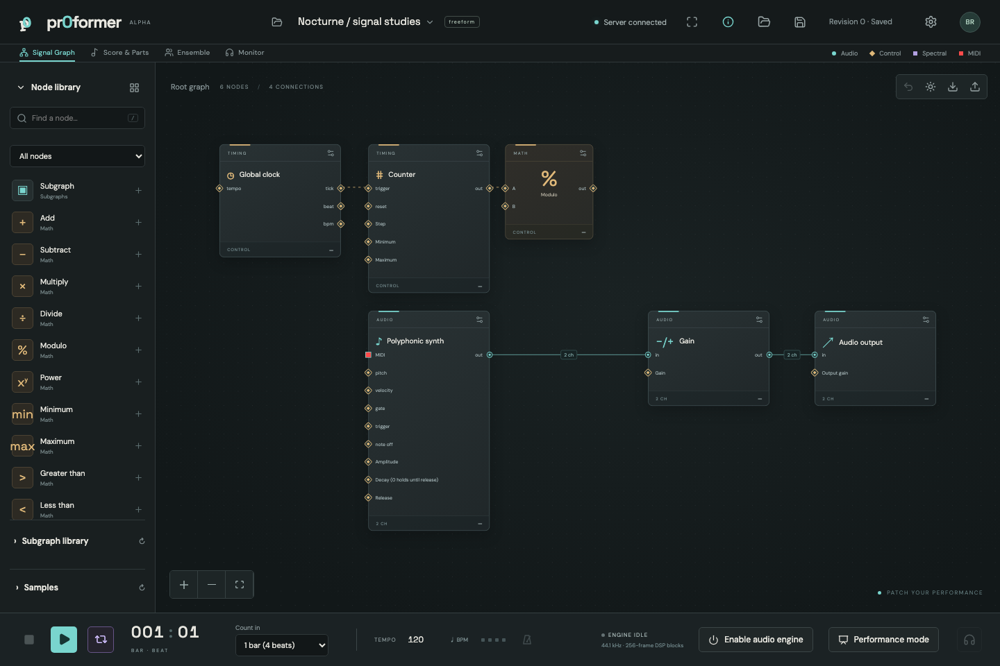

# pr0former

A self-hosted electroacoustic performance workspace: Vue scores and patches, a Rust DSP engine, shared musical time, MIDI/OSC output, and browser audio over WebRTC.

**Status: development alpha.** This is a working implementation foundation, not the completed performance-ready release described in the design. See [implementation status](docs/STATUS.md) for the exact remaining work and validation limits.



## Initial setup

```sh
./init.sh
```

The interactive script checks dependencies, offers installation, installs the locked frontend dependencies, builds the frontend and release server, offers tests, and asks about startup configuration. Run it as your normal user in a terminal. Homebrew/system package installation may request administrator access.

After changing or pulling source, rebuild with `./init.sh --update`. This noninteractive command installs the locked frontend dependencies, rebuilds the frontend, and builds the release server, reusing up-to-date Cargo artifacts. Existing build tools are required. It does not pull source, alter startup configuration, or restart a running server; restart the server after a successful update.

```sh
./init.sh --start
```

Startup prints the compiled Git commit and build time. `--start` checks the tracked remote branch without pulling, with an eight-second timeout; red warnings identify stale/dirty builds or an unavailable remote check. Startup continues when offline. `target/release/pr0-server --version` and `/api/status` also expose the compiled identity.

Starts the built release server in the foreground; press Ctrl-C to stop. If `.local/start-pr0former.sh` exists, its saved bind address and TLS settings are used. Otherwise, the server uses the current `PR0_` environment settings and listens on `0.0.0.0:4000` (all IPv4 interfaces) by default. Open http://127.0.0.1:4000 locally or use the server's LAN address from another device. This command skips setup and does not require an interactive terminal.

```sh
./init.sh --start --host 127.0.0.1 --port 4500
```

Use either flag or both. Each overrides only that component of the saved/environment address for this launch, preserving TLS and data settings. Hosts may be IPv4, IPv6 (for example `--host ::1`), or resolvable hostnames; ports must be 1–65535. These flags require the current release build (`cargo build --release --locked`). Existing saved scripts retain their configured address unless edited or regenerated.

```sh
./init.sh --stop
```

Stops servers launched with `--start` from this project, including from another terminal. Sends SIGTERM and waits up to 10 seconds per server, reporting a failure if it remains running. Repeated stops are harmless. Tracking applies to launches made with this version of the script; older launches can still be stopped with Ctrl-C. Startup services are managed separately through the menu below.

```sh
./init.sh --startup
```

This opens the startup menu directly: enable startup, disable startup and stop the service, generate only a launch script, or leave configuration unchanged. macOS uses a per-user LaunchAgent; Linux uses a systemd user service. Services start at login, not before login. No startup service is installed merely by cloning the project or running tests.

The script is stored under `.local/start-pr0former.sh`. Service configuration uses absolute paths, so rerun `--startup` after moving the repository. Application data stays in `data/`; disabling startup preserves it.

For moving to another server or continuing development in a new session, see [the migration and development handoff](docs/HANDOFF.md).

## Manual development

Install stable Rust, Node.js 22.12+, a C/C++ toolchain, CMake, and pkg-config. A system Opus library is preferred; Cargo can build its bundled copy. Linux additionally requires ALSA development headers.

```sh
cd web
npm ci
npm run build
cd ..
cargo run -p pr0-server
```

Open **http://127.0.0.1:4000**. The first visitor can create the initial account. Later accounts require an invitation generated by a project owner. Passwords must contain at least 8 characters.

For frontend hot reload, run `npm run dev` in `web/` alongside the Rust server. Vite proxies `/api` and WebSockets to port 4000.

Use **Project settings** during preparation to rename a project, choose structured/conducted/freeform playback, and set its initial tempo. Deactivate the show before changing these settings.

Use **Performance mode** in the project header for the stage view: select a part, follow its read-only score, watch the shared clock and queued launch/stop status, and open monitor controls as needed. The monitor connection stays alive when switching views. Fullscreen is available inside the stage view; Exit performance mode returns to the workspace. A timing-loss warning holds the displayed score until engine updates resume.

Create a project, activate it, and press Play. In conducted/freeform projects, open Score & parts and launch a part; structured projects start their parts together. The starter score drives a polyphonic synth through gain and output nodes. Audio starts muted. Open Monitor to connect a browser feed (master or a dedicated Monitor output), or Audio setup to enable the server's default output. Native microphone capture is enabled separately in Audio setup. Add a Browser input node, assign it to a part/performer, and select it in Monitor to route a browser microphone into the patch.

## LAN and HTTPS

Browser microphone capture requires a secure context. Localhost works for development; other devices need an HTTPS certificate trusted on each device.

```sh
PR0_BIND=0.0.0.0:4000 \
PR0_TLS_CERT=/absolute/path/server.pem \
PR0_TLS_KEY=/absolute/path/server-key.pem \
cargo run -p pr0-server
```

Use your own certificate authority or an existing trusted certificate. Install the CA certificate on the iPad and explicitly enable its trust. WebRTC also requires direct LAN UDP reachability; guest Wi-Fi/client isolation can prevent media connections. No external STUN/TURN service is configured.

Configuration:

| Variable | Default | Purpose |
|---|---|---|
| `PR0_BIND` | `0.0.0.0:4000` | HTTP/HTTPS listen address (all IPv4 interfaces) |
| `PR0_HOST`, `PR0_PORT` | unset | Override individual components of `PR0_BIND`; set by `--host` and `--port` |
| `PR0_DATA` | `data` | SQLite storage directory |
| `PR0_TLS_CERT`, `PR0_TLS_KEY` | unset | Enable HTTPS and Secure session cookies |
| `RUST_LOG` | unset | Rust tracing filter, e.g. `warn` |

The server serves `web/dist` relative to the repository root. The generated startup script sets the working directory correctly.

## Verification

```sh
cargo test --workspace
cargo fmt --all --check
cd web
npm test
npm run build
npx playwright install chromium
npm run test:e2e
```

Browser tests start an isolated server on port 3101 with a temporary database. They do not enable hardware audio, capture a real microphone, or install a startup service. The integration test exercises a real local WebRTC connection.

For the opt-in 32-client protocol/audio baseline, run `npm run test:load` from `web/`. It builds and starts the release server with a temporary database, creates 32 authenticated performers, and observes dedicated monitor feeds for 15 seconds. `PR0_LOAD_SECONDS=3600 npm run test:load` extends the observation to an hour. Results are written to `docs/load-baseline.json`; each run replaces that report. The fixture excludes application UI rendering, microphone uplinks, physical devices, and real LAN transit. Chromium output is muted. This test is separate from normal browser integration checks and does not establish physical performance latency.


`npm run test:load:ui` runs the same 32-player fixture through the actual Vue performance interface, selects assigned parts, and connects monitor feeds through the UI. It additionally checks JavaScript errors and ongoing playhead movement, and writes `docs/load-ui-baseline.json`. The duration is also controlled by `PR0_LOAD_SECONDS`. All load modes run locally in headless Chromium with browser output muted; they do not measure physical end-to-end latency.

`npm run test:load:uplink` adds 32 synthetic audio uploads to the Vue stage fixture using WebCodecs-generated tracks. Each browser sends audio through WebRTC into its Browser input node and receives its dedicated monitor feed. It checks continuing upload packets, server audio levels, return audio energy, and stage updates, and writes `docs/load-uplink-baseline.json`. This exercises the upload/processing/monitor path without physical microphones or device permission handling. `PR0_LOAD_SECONDS` also controls this observation.

## Development documentation

- [Architecture and contracts](docs/ARCHITECTURE.md)
- [Writing audio plugins](docs/PLUGINS.md)
- [Implementation status and remaining acceptance work](docs/STATUS.md)
- [TouchDesigner integration](examples/touchdesigner.md)

## Live patching and shortcuts

Nodes and connections can be edited during an active show in every performance mode. Changes apply after server preparation at the next DSP block. Unchanged processors keep their state; rewiring and changed processor settings can click because graph crossfades are not implemented.

- **Space:** activate and play; then toggle pause/resume.
- **Backspace / Delete:** remove selected graph nodes and connections.
- **Ctrl/Cmd+Z:** undo a graph edit, including live wiring/deletion.
- **Right-click a node:** Edit or Delete. Enter on a focused node opens its modal.

Shortcuts leave text fields and dialogs alone. Transport still requires owner/conductor authority.

For FM, connect **Oscillator → Audio to control → another Oscillator's Frequency**. Set the modulator amplitude to 1, conversion Scale to 100 and Offset to 440 for ±100 Hz deviation around 440 Hz. The converter reads the first channel on every sample; connected frequency is not smoothed. Frequency clamps to 0–20000 Hz.

For spectral editing, use **FFT → Spectral math / Spectral curve → Inverse FFT → Output**, with matching FFT size, overlap, and channels. Spectral math multiplies/adds magnitudes and phases. Spectral curve lets you draw magnitude multipliers and phase offsets from DC to Nyquist; release a stroke to apply it live. Negative-frequency bins mirror positive bins for real audio, and DC/Nyquist retain phase.
